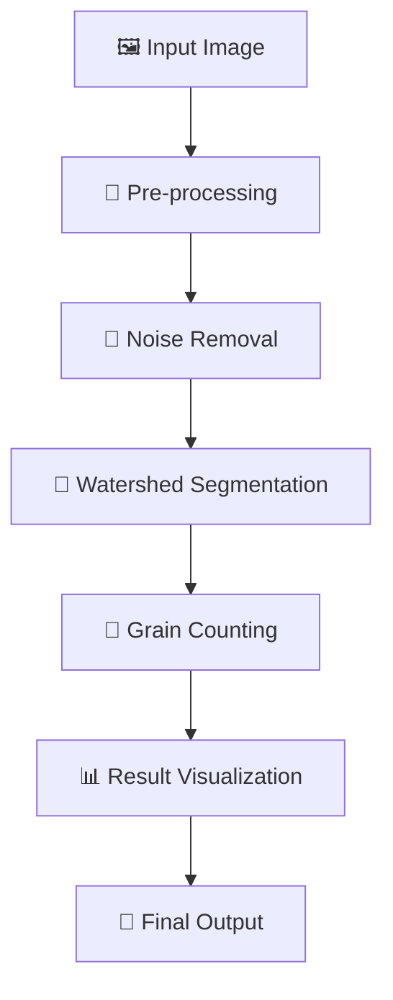

# 🌾 Simple Rice Detection

<div align="center">


### 🎯 **Automated Grain Counting** | 🔬 **Advanced CV Pipeline** | 🌐 **Easy Deployment**

⭐ **Star this repo if it helps you!** ⭐

🔥 **Share it with the community!** 🔥

[](https://x.com/intent/tweet?text=Check%20out%20this%20amazing%20Rice%20Detection%20project!%20🌾🤖%20Perfect%20for%20agriculture%20and%20research!%20https://github.com/Mushrum-mmb/Simple_Rice_Detection%20%23ComputerVision%20%23Agriculture%20%23OpenCV)
[](https://www.facebook.com/sharer/sharer.php?u=https://github.com/Mushrum-mmb/Simple_Rice_Detection)
[](https://www.linkedin.com/sharing/share-offsite/?url=https://github.com/Mushrum-mmb/Simple_Rice_Detection)
[](https://www.reddit.com/submit?title=Amazing%20Rice%20Detection%20Computer%20Vision%20Project&url=https://github.com/Mushrum-mmb/Simple_Rice_Detection)

</div>

---

## 📋 Table of Contents

<details>
<summary>🔍 <strong>Click to expand navigation</strong></summary>

- [🚀 About](#-about)
- [✨ Features](#-features)
- [⬇️ Installation](#️-installation)
- [▶️ Usage](#️-usage)
- [💻 Google Colab Usage](#-google-colab-usage)
- [🔧 How It Works](#-how-it-works)
- [🎯 Algorithm Deep Dive](#-algorithm-deep-dive)
- [📸 Gallery](#-gallery)
- [🤝 Contributing](#-contributing)
- [📜 License](#-license)

</details>

---

## 🚀 About

<div align="center">

**🌾 Revolutionary Computer Vision for Agricultural Applications!**

</div>

This cutting-edge computer vision application automatically detects and counts rice grains in images using a sophisticated hybrid approach that combines the **watershed algorithm** with **advanced contour detection**. Perfect for agricultural research, quality control, and grain analysis!

<div align="center">

| 🎯 **Algorithm** | 🛠️ **Framework** | 👨‍💻 **Author** | 🌐 **Interface** |
|:---:|:---:|:---:|:---:|
| **Watershed + Contour** | Gradio | [Mushrum-mmb](https://github.com/Mushrum-mmb/) | Web-based |

</div>

### 🌟 **Key Highlights:**
- 🔬 **Advanced hybrid detection** algorithm
- 🎯 **Accurate grain counting** even for touching grains
- 📊 **Visual processing pipeline** with step-by-step breakdown
- 🌐 **User-friendly web interface** with instant results
- 🚀 **Cloud-ready** for Google Colab deployment
- 📱 **Cross-platform compatibility**

---

## 📸 Gallery

<div align="center">

### 🔍 **See the Magic in Action!**


*Examples of successful rice grain detection and counting*

</div>

---

## ✨ Features

<div align="center">

### 🎭 **What Makes This Special?**

</div>

| Feature | Description | Benefit |
|---------|-------------|---------|
| 🔬 **Advanced Detection** | Hybrid watershed + contour algorithm | Accurate detection of touching grains |
| 🖼️ **Visual Pipeline** | Complete image processing workflow | Transparent and debuggable process |
| 🔢 **Automatic Counting** | Smart grain enumeration and labeling | Instant quantitative results |
| 📊 **Process Visualization** | Step-by-step processing breakdown | Educational and debugging value |
| 🌐 **Web Interface** | Gradio-powered user-friendly UI | No technical knowledge required |
| ☁️ **Cloud Compatible** | Google Colab ready deployment | Perfect for low-spec devices |

<div align="center">

### 🎯 **Perfect For:**
🌾 **Agricultural Research** • 🏭 **Quality Control** • 🎓 **Educational Projects** • 🔬 **Computer Vision Learning**

</div>

---

## ⬇️ Installation

<div align="center">

### 🛠️ **Get Started in Minutes!**

</div>

> **📋 Prerequisites:** Ensure you have Git installed and Python environment set up.

<details>
<summary>💻 <strong>Local Installation (Click to expand)</strong></summary>

**Step 1:** Install required dependencies
```bash
pip install torch numpy opencv-python gradio matplotlib
```

**Simple and lightweight!** Only 5 essential packages needed.

</details>

<details>
<summary>☁️ <strong>Google Colab Users (Click to expand)</strong></summary>

**Great news!** All dependencies are pre-installed in Google Colab:
- ✅ **No manual installation** required
- 🚀 **Ready to run** immediately
- 💻 **Perfect for low-spec devices**

</details>

---

## ▶️ Usage

<div align="center">

### 🚀 **Launch Your Rice Detector in 3 Simple Steps!**

</div>

**Step 1:** Clone the repository
```bash
git clone https://github.com/Mushrum-mmb/Simple_Rice_Detection.git
```

**Step 2:** Navigate to project directory
```bash
cd Simple_Rice_Detection
```

**Step 3:** Launch the application
```bash
python rice_detector.py
```

<div align="center">

### 🎉 **Your Rice Detector is Ready!**
Open the provided link in your browser and start analyzing rice images!

[](#)

</div>

---

## 💻 Google Colab Usage

<div align="center">

### ☁️ **Perfect for Everyone!** 🌤️

[](https://colab.research.google.com/drive/1uSx4NkhXVZqAetb9ug3tsZRLJ2CWwNpo?usp=sharing)

</div>

Experience the power of cloud computing! Our Google Colab notebook provides instant access to rice detection capabilities without any local setup.

<details>
<summary>📖 <strong>Quick Colab Guide (Click to expand)</strong></summary>

**Step 1:** Run the Gradio installation cell


**Step 2:** Execute the final cell and start detecting! 🎉

**That's it!** No uploads, no complex setup - just pure rice detection power in the cloud!

</details>

---

## 🔧 How It Works

<div align="center">

### 🏗️ **Computer Vision Pipeline Overview**

</div>

Our sophisticated system processes images through multiple intelligent stages:

<div align="center">



</div>

| Stage | Process | Technology |
|-------|---------|------------|
| 🎨 **Pre-processing** | Contrast enhancement & segmentation | OpenCV image processing |
| 🧹 **Noise Removal** | Morphological operations | Erosion, opening, dilation |
| 🌊 **Watershed** | Advanced grain separation | Distance transform + markers |
| 🔢 **Counting** | Intelligent grain enumeration | Contour detection + centroid |
| 📊 **Visualization** | Result presentation | Annotation + statistics |

---

## 🎯 Algorithm Deep Dive

<div align="center">

### 🔬 **The Science Behind the Magic**

</div>

<details>
<summary>🎨 <strong>1. Image Pre-processing (Click to expand)</strong></summary>

**Enhanced Image Quality:**
- 🌟 **Contrast & brightness adjustment** for optimal segmentation
- 🎨 **Color-based segmentation** to isolate rice from background
- ⚫ **Grayscale conversion** for mathematical processing
- 🔍 **Additional refinement** for precise grain definition

</details>

<details>
<summary>🧹 <strong>2. Noise Removal (Click to expand)</strong></summary>

**Clean Signal Processing:**
- 🔧 **Morphological kernel design** for targeted noise removal
- 🌊 **Opening operations** to smooth grain boundaries
- ⚡ **Erosion techniques** to separate touching grains
- 🎯 **Optimized for rice grain characteristics**

</details>

<details>
<summary>🌊 <strong>3. Watershed Segmentation (Click to expand)</strong></summary>

**Advanced Grain Separation:**
- 🎯 **Sure background creation** via dilation
- 📏 **Distance transform** to find grain centers
- 🔥 **Sure foreground identification** (grain cores)
- ❓ **Unknown region detection** (boundaries)
- 🏷️ **Marker-based labeling** for watershed
- 🌊 **Watershed algorithm execution** for final separation

</details>

<details>
<summary>🔢 <strong>4. Grain Counting & Analysis (Click to expand)</strong></summary>

**Intelligent Quantification:**
- 🎭 **Binary mask creation** for each detected grain
- 📐 **Contour detection** and analysis
- 📍 **Centroid calculation** and marking
- 🔄 **Supplementary contour detection** for missed grains
- 🤝 **Result combination** from multiple methods
- ✅ **Accuracy validation** and optimization

</details>

<details>
<summary>📊 <strong>5. Result Visualization (Click to expand)</strong></summary>

**Comprehensive Output:**
- 📸 **Step-by-step processing** (standalone version)
- 🏷️ **Annotated final image** with grain markers
- 📈 **Statistical summary** and grain count
- 🎨 **Color-coded visualization** for clarity

</details>

---

## 🤝 Contributing

<div align="center">

### 💡 **Help Improve Agricultural Technology!**

[](https://github.com/Mushrum-mmb/Simple_Rice_Detection/issues)

</div>

Join our mission to advance agricultural computer vision! Here's how you can contribute:

- 🐛 **Report bugs** and suggest improvements
- 🔬 **Test with different rice varieties** and share results
- 📖 **Improve documentation** and add tutorials
- 🎯 **Optimize algorithms** for better accuracy
- 🌾 **Add support for other grains** (wheat, barley, etc.)
- ⭐ **Star the repo** to show support!

### 🌟 **Ideas for Enhancement:**
- 📱 Mobile app development
- 🤖 Integration with IoT devices
- 📊 Batch processing capabilities
- 🎯 Quality assessment features
- 🌍 Multi-language support

---

## 📜 License

<div align="center">

[](https://opensource.org/licenses/MIT)

This project is licensed under the **MIT License** - see the [LICENSE](LICENSE) file for details.

</div>

---

<div align="center">

### 🌾 **Made with ❤️ by [Mushrum-mmb](https://github.com/Mushrum-mmb/)**

**Advancing agriculture through computer vision, one grain at a time! 🌾🤖**

[](https://github.com/Mushrum-mmb/Simple_Rice_Detection/stargazers)
[](https://github.com/Mushrum-mmb/Simple_Rice_Detection/network)

---

**🚀 Happy Detecting! 🌾✨**

*"Every grain counts, and now we can count every grain!"*

</div>
